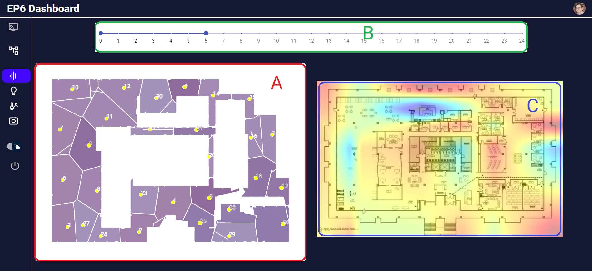
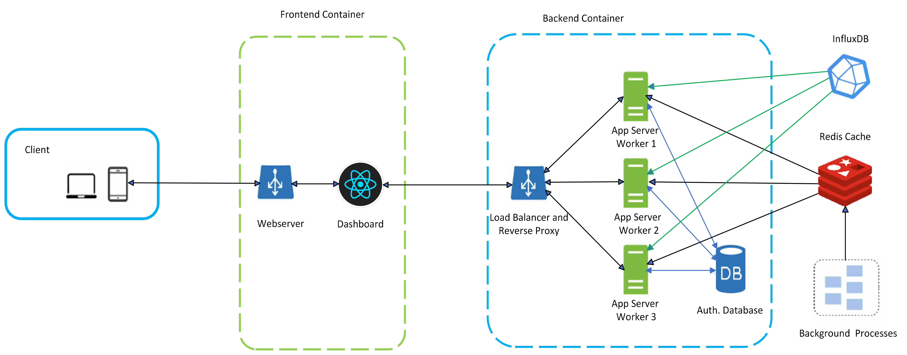

# Dashboard for Executive Park 6


## Introduction

EP6 Dashboard presents details and summary of data collected at Executive Park 6 and Status of Devices. It produces following measure views:

**a] Position of Sensors in EP6 and Heatmap**



**b] Graphical Representation of data collected by Sensors**


**<u>c] Status of Sensors and Edge Devices in EP6</u>**


## Requirements

Following runtimes and softwares are needed:

- [Python](https://www.python.org/) (Backend Application Server)
- [Node](https://nodejs.org/en/) (Frontend Runtime)
- [Redis](https://redis.io/) (Key store for efficient data exchange)
- [Docker](https://www.docker.com/) (For Deployment purpose only)
- [InfluxDB](https://www.influxdata.com/) (Time Series Database)
- [Nginx](https://www.nginx.com/) (Load Balancer and Proxy)

Follwing Frameworks and libraries has been used internally:

- [React](https://github.com/facebook/react) (Frontend library)
- [D3.js](https://d3js.org/) (Progressive Charting Library)
- [Chart.js](https://www.chartjs.org/) (Charting library)
- [Flask](https://github.com/pallets/flask) (Application Server Development framework)
- [Sqlite](https://github.com/sqlite/sqlite) (For Lightweight temporary database)

## Architecture Diagram

Following diagram depicts a brief structure of system with the data flows.




## In Details

The structure of `backend` directory us given as follows:

```
├──  app
│    └── audio                      - Audio Service API
│        └── __init__.py
│        └── routes.py
│    └── base                       - Common Services like Auth
│        └── __init__.py
│        └── email.py
│        └── forms.py
│        └── models.py
│        └── util.py
│    └── humidity                   - Humidity and Temperature Service APIs
│        └── __init__.py
│        └── routes.py
│    └── illuminance                - Illuminance Service APIs
│        └── __init__.py
│        └── routes.py
│    └── mail                       - Mail Service
│        └── __init__.py
│        └── routes.py
│    └── utils                      - Utility Functions
│        └── Database.py
│        └── Redis.py
│    └── visuals                    - Visual and RPI status APIs
│        └── __init__.py
│        └── routes.py
│    └── __init__.py                - modularizing file
│
│
├──  logs
│    └── server.log                 - log file
│
│
├──  media                          - Static folder for future media
│
│
├──  nginx
│    └── ep6_dashboard.service      - service file for daemon if added as linux service
│    └── ep6-dashboard.conf         - Nginx configuration file
│
│
├── .env                            - Contains environment specific variables
├── cache.py                        - Caching layer
├── config.py                       - Configuration Layer
├── db.sqlite3                      - Credentials database ( To be replaced by strategic DB)
├── device_mapping.json             - Mapping of RPI IP Address to Region ID
├── Dockerfile                      - Docker packaging instructions
├── gunicorn-cfg.py                 - gunicorn configuration file ( only for linux)
├── logging.conf                    - Logger configuration files
├── requirements.txt                - Python Dependency list
├── run.py                          - Script invoking the server

```

<hr>

## Setting up on the Local machine

1. Install the necessary python packages for the backend using following steps:

```bash
cd backend
pip install -r requirements.txt
```

Now run the application server using following commands:

```bash
python3 run.py
```

### Run the Server with multiple workers

You should have gunicorn installed before using this feature.
This helps in serving multiple worker nodes to handle incoming concurrent requests.
You can specify the number of worker threads with parameter **--workers**.
We are using 5 in this example.

```bash
gunicorn --workers 5 --bind 0.0.0.0:9800 run:app
```

This would start an application server on port 6800.

2. Install the NPM packages necessary for the front end by following commands:

```bash
cd ../dashboard
npm install .
npm start
```

The dashboard would be accessible at [http://localhost:6800/](http://localhost:6800/)

<hr>

## Deploying on EP6 Server manually

1. Install the necessary python packages for the backend using following steps:

```bash
cd backend
pip install -r requirements.txt
```

Now run the application server using following commands:

```bash
nohup python3 run.py &
```

This would start an application server on port 6800.

2. Install the NPM packages necessary for the front end by following commands:

```bash
cd ../dashboard
npm install .
npm run build
```

This would create a `build\` folder inside the directory `.dashboard\`.
We will host a python HTTP server to render this on the port 6800 (which is open to external connections)
Run following steps for it

```bash
cd build
nohup python3 -m http.server 6800 &
```

The dashboard would be accessible at [http://mcibmi1.bmi.emory.edu:6800/](http://mcibmi1.bmi.emory.edu:6800/)

<hr>

## Deploying on EP6 using Docker Containers

Instead of following above complex steps, we decided to resort to Docker containers which are quick and easy to deploy.
We can create the container of Application Server (backend) using following steps:

```bash
cd backend
docker build . -t app-server
docker run -dp 9800:9800 app-server
```

For running the frontend docker container, we can simply executed

```bash
cd dashboard
docker build . -t dashboard
docker run -dp 80:80 dashboard
```

The dashboard would be accessible at [http://mcibmi1.bmi.emory.edu/](http://mcibmi1.bmi.emory.edu/)

## Future Work

- Improving Site Security
- Setting up Kubernetes cluster _if active users go beyond 500_
