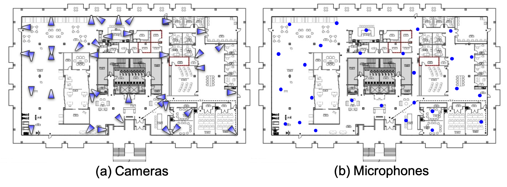

# Summary

In a clinical environment, the activity of an individual can provide deep insights into the well-being and health status of individuals, as well as socio-behavioral context. Although the recent pandemic has emphasized the importance of social distancing, the impact of proxemic behavior on interpersonal communication is perhaps more important. However, measuring and evaluating interactions between individuals is difficult, particularly using on-body sensors. Standard patient monitoring solutions are expensive, require high compliance and effort to use, and are unable to capture detailed activities across large areas. Off-body monitoring provides a potential solution to these issues. There are currently two types of solutions: motion sensors that can only detect the presence of a person; and surveillance cameras that require significant changes to infrastructure for installation and carry significant privacy concerns. This study proposes a novel and low-cost off-body patient monitoring system and dashboard based on edge computing technology. The system tracks individuals’ activities across a large indoor area (18,000 square feet). This information is displayed in an interactive dashboard in real-time that is easy to use with little technical training required. At our study site, a clinical therapy unit for Mild Cognitive Impairment (MCI), we installed 38 edge computing systems comprising a Raspberry Pi 4 model B, camera, microphone, Bluetooth receiver, humidity and temperature sensor, and a Google Coral USB Tensor Processing Unit (TPU). The edge compute systems were installed at regular intervals in the ceiling to monitor the ambient conditions and individual activities. The full system preserves privacy by preprocessing the captured sensor data in real time using the TPU to extract deidentified features prior to storing the data. Our dashboard provides a visualization of the data captured from multi-modal sensors from each edge system in real time. This allows staff to react and intervene quickly when any undesired behavior is observed, such as wandering or confusion, or device malfunctions. The proposed monitoring system can easily be installed in any ordinary indoor space by connecting all edge computing nodes to the local network and power source through existing infrastructure. Our dashboard and edge computing framework can therefore help transform any health care institute into a smart space to improve patient care. 

<!-- In smart hospitals, monitoring patients' activity is critical as they are highly correlated with the well-being and health status of individuals. Moreover, it is crucial to automatically monitor social distance in real-time, especially during pandemics, to prevent disease contamination among immunocompromised populations. The problem arises, however, when standard patient monitoring solutions are expensive, manually intensive, or unable to capture detailed activities across large areas. There are currently two types of solutions: motion sensors that can only detect the presence of a person or surveillance cameras that require significant changes to infrastructure for installation. This study proposes a novel and low-cost non-contact patient monitoring system and dashboard based on edge computing technology. The system can track patients' activities across a large indoor area (18,000+ square feet). This information is displayed in an interactive dashboard in real-time that is easy to use even for people who aren't technically savvy. In our study site, we installed 38 Raspberry Pis attached with camera, microphone, Bluetooth, and humidity and temperature sensors. Those Pis are installed all across the hospital floor to monitor the ambient condition and patient activities. The system preserves patients’ privacy by preprocessing the captured sensor data in real time using Google Coral USB TPU to extract deidentified features before storing the data. In real-time, our dashboard system visualizes the data captured from multi-modal sensors in each Pi so that staff can react and intervene quickly when any undesired behavior is observed. Users can also monitor the health status of each Pi from our dashboard to react quickly to any malfunctions. The proposed monitoring system can easily be installed in any ordinary indoor space by connecting all Pis to the local network and power source through the ceiling of the existing infrastructure. Our dashboard and edge computing framework will help transform any health care institute into a smart space to improve patient care. -->

# Statement of Need

For a distributed sensor network application like this, it becomes very important to ensure that all of the sensors are working reliably over an extended period of time. In order to ensure this, we developed a robust mechanism to check the health of edge computing nodes [@RaspberryPi] and their sensors. The results from this upstream system are displayed on an interactive dashboard, which we mainly propose in this work. A dashboard was designed that provides an intuitive interface for practitioners without programming experience to understand patient activities captured from a distributed sensor framework using edge and cloud computing. The proposed system can i) communicate information efficiently, ii) display overall ambient condition and patient activity data in an interpretable manner, and iii) show longitudinal trends and changes in sensor data.

# Background: Distributed Sensor System and Computing Architecture 

{ width=50% }

The study space is installed with 38 edge computing nodes having multiple sensors [@suresha2022edge], as shown in Figure 1. It senses Bluetooth beacon [@Bluetooth] carried by patients, ambient temperature, and humidity in the space [@TempHumid]. With the addition of a camera [@Camera], microphone [@Respeaker], and Google Coral USB TPU [@Coral], each edge computing node is able to process patient activity information efficiently, allowing it to extract movement and speech activity across the study site with an area of over 18,000 square feet. Figure 2 shows the overall installation of cameras and microphones using 38 edge computing nodes at the study site. All 38 edge computing nodes have cameras, temperature and humidity sensors, Bluetooth, and Coral TPU. Out of 38 edge computing nodes, a subset of 29 edge computing nodes have microphones installed, which was sufficient to cover the sound events occurring in the study site.

{ width=70% }

Overall computer network architecture is shown in Figure 3. Multi-modal raw sensor data captured from 38 edge cmputing nodes are processed on-device to preserve patient privacy and only the processed data are transferred to the on-premise fog computing node in real time. An entire day's worth of data is stored in the fog computing node, which is synced to the cloud computing node every night. The frontend dashboard, which we propose in this work, is hosted on the fog computing node to monitor preprocessed sensor data.

## Audio Pipeline Analysis

Conversational behavior is an important part of health analysis, as speech behavior reflects the mental state of patients. For example, seniors experiencing cognitive impairment tend to socially isolate themselves, which can lead to serious depression [@zafar2021loneliness]. In our sensor network, we collect ambient acoustic signals in a built-in environment through respeaker USB microphone arrays [@Respeak] placed on the ceiling. When the microphone detects conversation activities, we process raw acoustic signals to extract unidentified acoustic features on edge computing nodes, which are Melspectogram [@Melspectogram] and MFCC [@Melspectogram], to preserve patient privacy. Through these features, we perform speaker diarization [@Diarizaion] to analyze the speech behavior of patients. 

## Visual Pipeline Analysis

Monitoring patient movements throughout the day and space is crucial for health implications. We use 38 cameras to track the movements of patients across a large space. Specifically, we detect 2D poses of people captured in the scene by using a state-of-the-art 2D pose estimation method [@Pose2D] that runs on edge computing nodes in real-time, which can preserve the privacy of patients. The detected 2D poses are projected at the corresponding location in the study space. Each patient's location is tracked over time using the multi-view, multi-person tracking algorithm [@li2010multiple] in order to understand how the patient uses space and moves.

## Bluetooth Pipeline Analysis

In the Bluetooth pipeline analysis, we gather the BLE signals from the BLE Beacons [@Bluetooth] carried by the participants through the edge computing nodes placed on the ceiling. We only store the MAC address and the corresponding RSSI of the BLE beacons to preserve privacy. Custom real-time algorithms are provided to detect the position of individuals wearing Bluetooth beacons. With the collected RSSI data, we perform RSSI-based Trilateration [@Trilateration] to track the movements of patients in the study space. Because the patients wear unique Bluetooth beacons, we can correlate the patient's location tracked by BLE with camera-based localization analysis to pinpoint the exact patient undergoing activities in the space. 

## Humidity and Temperature Monitoring

By having temperature and humidity recorded in each partition of healthcare facilities, we can determine the ambient conditions patients are exposed to [@temp_hum]. In this study, we used the DHT22 Temperature-Humidity sensor module [@TempHumid] in conjunction with edge computing nodes to record the variation in temperature and humidity. The DHT22 sensor comprises a thermistor and a capacitive humidity sensor that measures the surrounding air to provide calibrated temperature and humidity values. The sampling frequency is 1Hz, the temperature range is −40 to 80 °C, and the humidity range is 0–100% RH.

# Proposed Work: Interactive Dashboard for Monitoring Multi-modal Edge Computing System

To implement the dashboard system to monitor the health status of edge computing nodes and display the processed data, we have followed a scalable three-tier architecture based on Flask [@Flask], as shown in Figure 4, as an application server hosted with Nginx [@Nginx] as a load balancer and reverse proxy. The frontend is designed with React [@React] and served through Nginx as a web server. We are using InfluxDB [@InfluxDB] as the database for storing the time series data generated by edge devices. Redis [@Redis] is used as key-value storage to interact with background Python [@Python] processes, whose output is consumed on the dashboard. MySQL [@MySQL] database is used for storing the authentication and authorization of users.
Therefore, the proposed frontend `Dashboard` is a unified portal developed using Python [@Python] packages and React [@React] framework to monitor indoor activities through audio, visual, and spatial tracking. It monitors the following activities from our sensor and computing framework:
1. Sensor Health
2. Audio
3. Visual
4. Indoor Temperature and Humidity
Each piece of information can be monitored by selecting the left side bard in the proposed dashboard shown in Figure 5.

##  Monitoring Sensor Breakdown

Figure 5 (A) represents the position of each edge computing node in our built-in environment (18,000 square feet) schematic that was shown in Figure 2. If clicked on a particular region, it displays the status of sensors connected to that particular edge computing node as shown in Figure 5 (C). The table in Figure 5 (B) represents the list of all edge computing nodes with their status and an option to reboot them remotely.

## Audio Pipeline Analysis

Using a multi-array microphone system connected to edge computing node, practitioners can monitor the power of acoustic signals measured in decibels for each edge computing node by clicking on the microphone of interest, as shown in Figure 6, giving insights into each location's sound event. The dashboard system has four channels representing four directional sound sources surrounding the edge computing node.

With the detected audio activity, we conduct an acoustic occupancy analysis, which shows overall conversation activities among the patients in the built-in space. Figure 7 represents the image of the audio section on our dashboard. Figure 7 (A) shows the physical location of microphone arrays in the built-in environment. To monitor hourly occupancy, we plot the heatmap of occupancy based on the audio signals captured across our study space, as shown in Figure 7 (C). The slider in Figure 7 (B) can be used to change a specific time range of the day for monitoring acoustic occupancy in the space.

## Visual Pipeline Analysis

{ width=50% }

The movements of patients are displayed on the dashboard, as shown in Figure 8. The dashboard also displays the processed patient’s location data in a heatmap. Heatmap, as the name suggests, displays the occupancy in terms of heat signature to visualize the population distribution throughout the study site. Together with the acoustic signal, we can determine whether or not social interactions resulted in engaging conversations among patients. To determine which camera was capturing the patient's data at a particular moment, the dashboard also displays the camera location associated with the identifier number of edge computing node.

## Humidity and Temperature Monitoring

Figure 9 represents the temperature and humidity tab on the proposed dashboard. Similar to the audio section, users can monitor hourly occupancy. We plot the heatmap of temperature based on the received signal with a 1Hz sampling frequency. Users can adjust the time range for accessing heat signatures at the study site by adjusting a slider. This feature can be used to monitor the relative temperature and humidity across the building if any undesired event occurred at a particular time.

On the whole, the dashboard system, which is integrated with a distributed sensor network, computing architecture, and data analysis pipeline, provides the capability to monitor large-scale, time-intensive sensor data effectively and automatically. With a few clicks, practitioners without technical backgrounds can quickly select edge computing node and sensors of interest. It is expected that the proposed dashboard framework along with the edge and cloud-powered system can transform any ordinary space into a smart environment at a low cost.

# Acknowledgements

This work is part of the Cognitive Empowerment Program, which is supported by James M. Cox Foundation and Cox Enterprises, Inc., in support of Emory’s Brain Health Center and Georgia Institute of Technology.

# References

