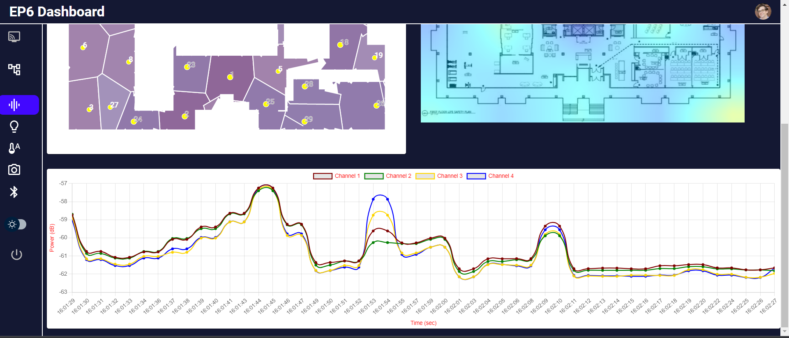

# Summary

Low-cost and non-contact patient monitoring system using edge computing platform enables longitudinal clinical studies in resource-limited settings. Patient monitoring systems need to capture both patient activities and ambient environmental conditions to understand patients’ conditions to provide appropriate interventions. In this work, we propose a low-cost indoor monitoring system that uses 39 edge computing systems connected to a fog server layer installed in a built-in environment that can capture multi-modal sensors, including audio, video, Bluetooth strength, temperature, and humidity at multiple locations simultaneously. The system preserves patients’ privacy by preprocessing the captured sensor data in real-time using Google Coral USB TPU to extract deidentified features before storing the data. The analyzed patients' activities and ambient conditions are visualized in a dashboard for clinical practitioners to refer for patient care. 

# Statement of Need

For a distributed sensor network application like this, it becomes very important to ensure that all of the sensors are working faithfully and recording the data. To ensure this, we developed a robust mechanism to check the health of each of the Raspberry Pi [@RaspberryPi] and sensors mounted to it. The results from this upstream system are sourced to the dashboard. We designed our home-built dashboard to answer the following needs in our study which is scalable to other healthcare monitoring facilities/environments : 1.Communicate information quickly. 2. Display information clearly and efficiently. 3. Show trends and changes in data over time. 4. Easily customizable and scalable. 5. Presenting data components in a limited space.

# System Architecture 

The study space is installed with 39 Raspberry Pis [@RaspberryPi] having multiple sensors, as shown in Figure 1. It senses Bluetooth beacon [@Bluetooth] carried by patients, ambient temperature and humidity sensors [@TempHumid], camera [@Camera], microphone [@Respeak], and Google Coral USB TPU [@Coral] for acceleration.

Overall computer network architecture is shown in Figure 2. 39 Raspberry Pis are transferring multi-modal sensor data to the on-premise fog computing node in real-time. One day volume of data stored in the fog computing node is nightly synced to the cloud computing node for permanent data storage. All sensor data is processed in Raspberry Pis on the device in real time. The frontend dashboard to monitor preprocessed sensor data are hosted in the fog computing node.

To implement the aforementioned system, we have followed a scalable three-tier architecture using Flask [@Flask], as shown in Figure 3, as an application server hosted with Nginx [@Nginx] as a load balancer and reverse proxy. The frontend is designed with React [@React] for and served through Nginx as web server. We are using InfluxDB [@InfluxDB] as the database for storing the time series data generated by the edge devices. Redis [@Redis] is used as a key-value storage to interact with background python [@Python] processes, whose output is consumed on the dashboard. MySQL [@MySQL] database is used for storing the authentication and authorization of users.

# Monitoring the Sensor Network

The frontend `Dashboard` is a unified portal developed using python [@Python] packages and React [@React] framework to monitor indoor activities through audio, visual, and spatial tracking. It monitors the following activities:
1. Audio
2. Visual
3. Indoor Temperature and Humidity
4. Bluetooth

Section (A) in Figure 4 represents the position of each Raspberry Pi on our built-in environment (18,000 square feet) schematic. If clicked on a particular region, it shows the status of sensors connected to that particular Raspberry Pi as shown in section (C) of Figure 4. Lastly, the table in section (B) of Figure 4 represents the list of all Raspberry Pi with their status and an option to reboot them remotely.  

# Audio Pipeline Analysis

As part of the audio capture and analysis pipeline, we collect the environmental acoustic signals in a built-in environment through respeaker USB microphone arrays [@Respeak] placed on the ceiling. Since the microphone can capture the conversations of patients, we process raw acoustic signals to extract unidentified acoustic features, which are Melspectogram [@Melspectogram] and MFCC [@MFCC], to preserve patient privacy. Through these features, we perform speaker diarization [@Diarizaion] followed by tagging the respective participants' groups [@Tagging]. Through these, our system can measure conversation or environmental audio cues related to ongoing patients’ activities. Figure 5 shows the power of acoustic signal measured in decibel captured at a Raspberry Pi.

With the detected audio activity, we conduct acoustic occupancy analysis, which shows overall conversation activities among the patients in the built-in space. Figure 6 represents the image of Audio section on our dashboard. Section (A) shows the physical location of microphone arrays in the built-in environment. To monitor hourly occupancy, we plot the heatmap of occupancy based on the audio signals captured across our study space, as shown in section (C). The slider in section (B) of Figure 6 can be used to change the particular time range for monitoring occupancy in the space.

# Visual Pipeline Analysis

The camera is used to track the movements of the patients in the space. Specifically, we detect 2D poses of people captured in the scene by using a state-of-the-art 2D pose estimation method [@Pose2D] that runs on Raspberry Pi in real-time, which can preserve the privacy of patients. The detected 2D poses are projected to the corresponding location in the study space, and the movements of patients are displayed in the dashboard in real-time, as shown in Figure 7. Monitoring patients’ movements in the space over time helps to understand the engagement of each patient in social interactions, which gives clues to patients’ mental health.

Dashboard also displays the processed patient’s location data in heatmap. Heatmap, as the name suggests, displays the occupancy in terms of heat signature to visualize the population distribution throughout the EP6 floor. Combined with the heatmap based on the acoustic signal mentioned above, we can tell if the social interactions among patients have led to engaging conversations or not. The dashboard also shows the camera location associated with Raspberry Pi identifier number to find which camera was capturing the patient’s data at a specific moment.

# Humidity and Temperature Monitoring

Having temperature and humidity in each partition of the health care facilities could provide us valuable information for various studies[@temp_hum]. In this study, we used the DHT22 Temperature-Humidity sensor module in conjunction with an RPi to record the variation in temperature and humidity. The DHT22 sensor comprised a thermistor and a capacitive humidity sensor that measured the surrounding air to provide calibrated temperature and humidity values. The sampling frequency is 1Hz, the temperature range was −40 to 80 °C, and the humidity range was 0–100% RH. 

Figure 8 represents the temperature and humidity tab on o home-built dashboard. Similar to audio section, use can monitor the hourly occupancy, we plot the heatmap of temperature based on the received signal with 1Hz sampling frequency. An slider has been designed so the user can access the the desired time frame signal and heatmap. This feature can be used to monitor the relative temperature and humidity across the building. 

# Bluetooth Pipeline Analysis

In the Bluetooth pipeline analysis, we gather the BLE signals from the BLE Beacons carried by the participants through the Raspberry Pis placed in the ceiling. We only store the MAC address and the corresponding RSSI of the BLE Beacons, thus preserving participant privacy.
Custom real-time algorithms are provided to detect the position of individuals wearing Bluetooth beacons moving around a built environment. With the collected RSSI data, we perform RNSI-weighted, RSSI-based Trilateration [@Trilateration] to track the movements of patients in the study space. Since the patients are equipped with unique BLE Beacons, we can associate the patient’s location tracked with BLE and camera to identify the exact patient that is undergoing social interactions in the space.

Occupancy analysis of different areas in EP6 helps us correspond the movements of participants and their activities in Figure 8 represents the image of Bluetooth Localisation section on EP6 dashboard. Section (A) shows the location of Raspberry Pis in the EP6 lab. Section B) shows the real-time location of participants in EP6

Figure TK by Krishna and Yash

# Acknowledgements
This work is part of the Cognitive Empowerment Program, which is supported by a generous investment from the James M. Cox Foundation and Cox Enterprises, Inc., in support of Emory’s Brain Health Center and Georgia Institute of Technology.

# References

